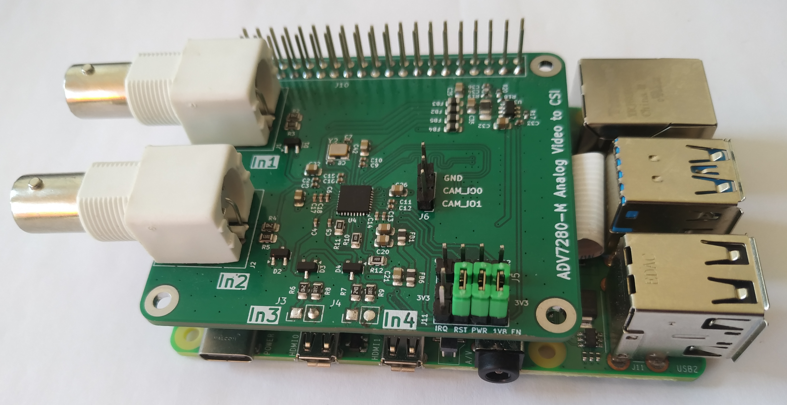
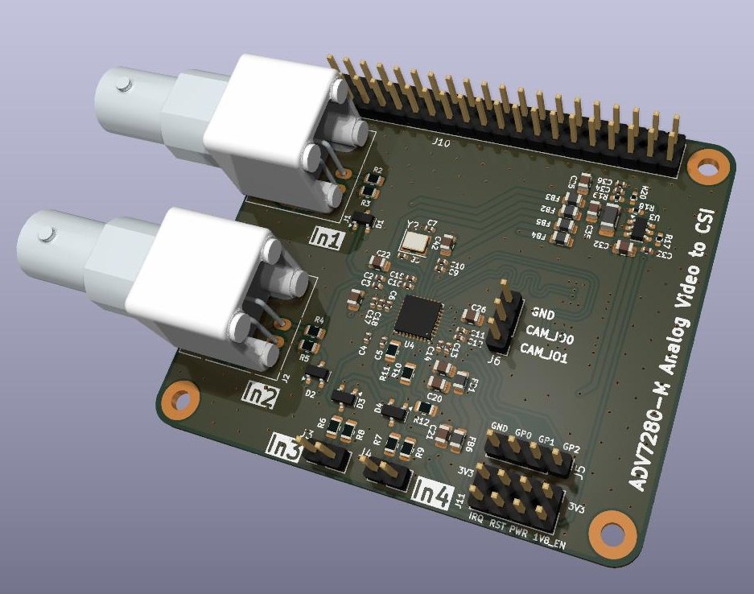
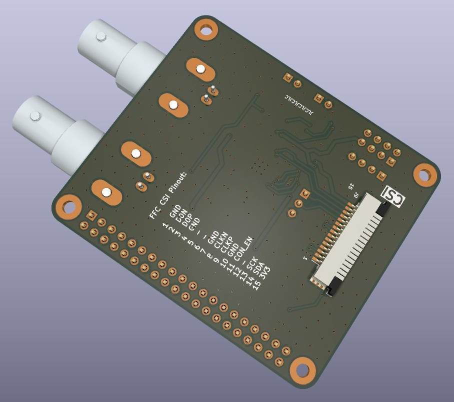

# ADV7280 based analog video digitizer shield for raspberry pi

Raspberry pi shiel built around the ADV7280 analog video decoder IC. Connection to raspberry pi over
MIPI CSI-2 interface. FFC/FPC connector on the shield has the same pinout as the pi camera connector.

<p float="center">
  
</p>

One huge advantage the ADV7280 has over similiar analog video decoders is that the drivers are already
present in the standard raspberry pi linux kernel. All you have to do is enable the driver in the
config.txt file. This shield is more or less plug'n'play.

# Hardware

The whole circuit design is copied exactly from the <a href="https://www.analog.com/media/en/technical-documentation/data-sheets/ADV7280.PDF">ADV7280 datasheet</a>

<p float="left">
  
  
</p>

Video inputs are done with BNC connectors. The only reason is that I got these really cheap so I use
them everywhere. All video inputs are terminated with 75R resistors close to the connector. For
protection there are BAT54S diodes installed on all used inputs. Because of space constraints only
inputs 1 - 4 are available on the PCB.

In the beginning I was unsure how to set the RST, PWRDWN pins of the ADV7280 and how important
the power cycling is when booting the IC. That is what the jumper pins near the raspberry pi's
USB connectors are for. Turns out you can leave them all connected to +3.3V all the time.

I was unsure about the CAM_IO1 and CAM_IO2 pins of the raspberry CSI connector as well. The pins
on the pin header can be left unconnected.

The only really critical traces in my opinion are from the CSI output from the IC to the FFC/FPC
camera connector. Looking at the technical specs in the MIPI CSI standard these traces the traces
should have 100R differential impedance (+/- 10%). To get the correct trace width and spacing I
used kicad's builtin calculation tool and the PCB dimensions of the manufacturer. With these I
fiddled around with the calculation until it was close enough.

This design is routed for ordering at JLCPCB (not sponsored!). This is important because different
manufacturers may have different PCB dimensions, which in turn affects the trace impedance of the
CSI traces. Make sure to get this correct, otherwise the CSI connection may not work reliably.

Until now the shield is running fine and I encountered no problems while running.

# Software

All connections this shield needs for running is the CSI connector to the raspberry pi's camera
interface. Enabling the kernel module for this shield is done in the config.txt file:

```
[all]
# enable adv7280
dtoverlay=adv728x-m,adv7280m=1
```

Done! After booting you should get a ne video device.
You can check this with v4l2-ctl command line utility.

```
$ v4l2-ctl --list-devices
$ v4l2-ctl -D -d 0
```

## setting video standard

Video standard is set to NTSC as default. Change it with this command
```
$ v4l2-ctl --set-standard pal
$ v4l2-ctl --set-standard ntsc
```

## changing inputs

Selecting video input source is not straight forward. This is not streamlined in the driver.
Doing this is a little bit hacky, but it works.

```
$ sudo bash -c "echo 0 > /sys/module/adv7180/parameters/dbg_input"
```

Change the number to the input you want to select. 0 corresponds to input 1 and so forth.
You can check the detected input format with

```
$ v4l2-ctl -S
```

## picture adjustment

Here is the interesting part. You can adjust brightness, saturation and so on inside the ADV7280.
No need to fiddle around with i2c registers. When the driver is loaded the corresponding i2c bus
is not exposed for reading or writing. Instead everything is handled through the v4l2-ctl utility.

To list the available settings use one of these commands:

```
$ v4l2-ctl -d <device> -l
$ v4l2-ctl -d <device> -L
```

This gives a description of all available settings and also shows the value range for each setting. If you want to change something use this command:

```
$ v4l2-ctl -d <device> -c <setting>=<value>
```
